# 中华人民共和国2025年国民经济和社会发展统计公报

> **国家统计局** | 2026年2月28日发布  
> 来源：https://www.stats.gov.cn/sj/zxfbhjd/202602/t20260228_1962662.html

## 一、综合

初步核算，全年国内生产总值[2]1401879亿元，比上年增长5.0%。其中，第一产业增加值93347亿元，比上年增长3.9%；第二产业增加值499653亿元，增长4.5%；第三产业增加值808879亿元，增长5.4%。第一产业增加值占国内生产总值比重为6.7%，第二产业增加值比重为35.6%，第三产业增加值比重为57.7%。最终消费支出拉动国内生产总值增长2.6个百分点，资本形成总额拉动国内生产总值增长0.8个百分点，货物和服务净出口拉动国内生产总值增长1.6个百分点。分季度看，一季度国内生产总值同比增长5.4%，二季度增长5.2%，三季度增长4.8%，四季度增长4.5%。全年人均国内生产总值99665元，比上年增长5.1%。国民总收入[3]1393700亿元，比上年增长5.1%。全员劳动生产率[4]为184413元/人，比上年提高6.1%。

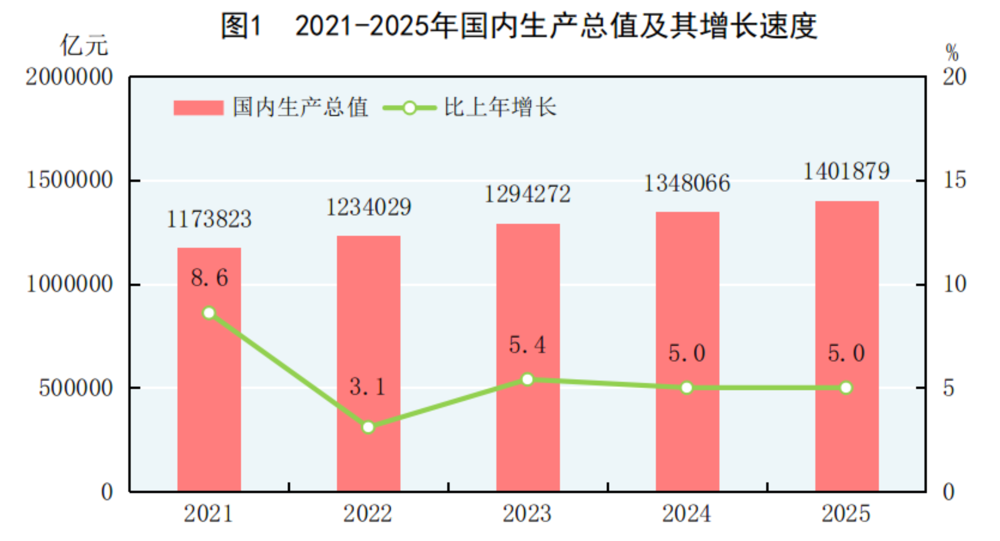

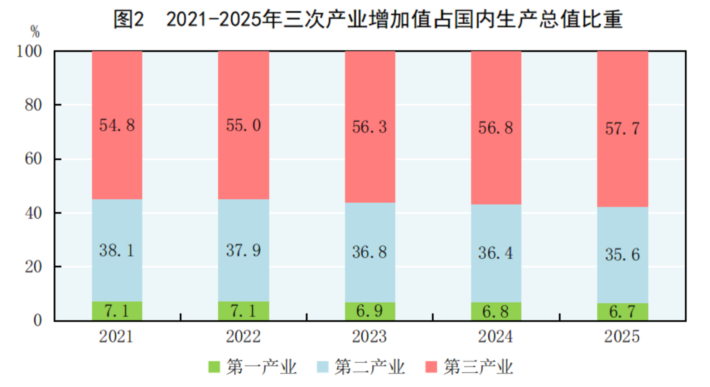

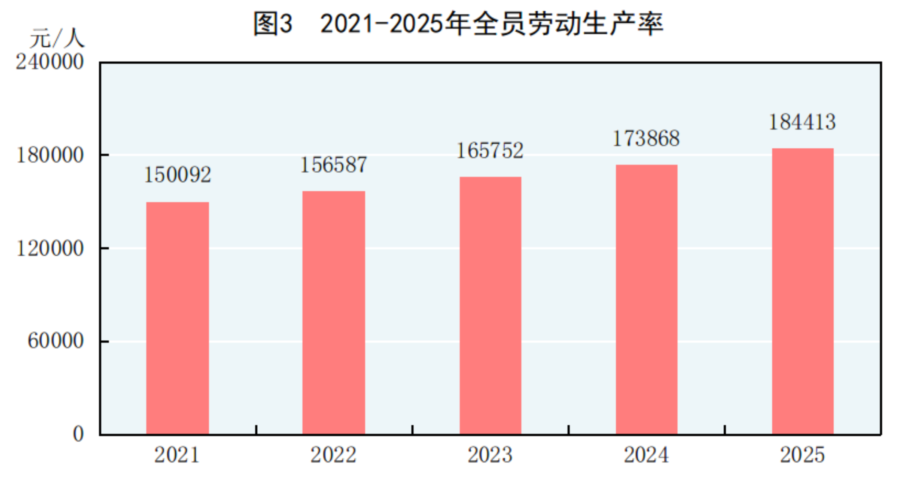

年末全国人口[5]140489万人，比上年末减少339万人，其中城镇常住人口95380万人。全年出生人口792万人，出生率为5.63‰；死亡人口1131万人，死亡率为8.04‰；自然增长率为-2.41‰。

### 表1　2025年年末人口数及其构成

| 指标                            | 年末数（万人） | 比重（%） |
| ------------------------------- | -------------- | --------- |
| 全国人口                        | 140489         | 100.0     |
| 其中：城镇                      | 95380          | 67.9      |
| 乡村                            | 45109          | 32.1      |
| 其中：男性                      | 71685          | 51.0      |
| 女性                            | 68804          | 49.0      |
| 其中：0-15岁（含不满16周岁）[6] | 23015          | 16.4      |
| 16-59岁（含不满60周岁）         | 85136          | 60.6      |
| 60周岁及以上                    | 32338          | 23.0      |
| 其中：65周岁及以上              | 22365          | 15.9      |

年末全国就业人员72504万人，其中城镇就业人员47535万人，占全国就业人员比重为65.6%。全年全国城镇新增就业[7]1267万人，比上年多增11万人。全年全国城镇调查失业率平均值为5.2%。年末全国城镇调查失业率为5.1%。全国农民工[8]总量30115万人，比上年增长0.5%。其中，外出农民工18006万人，增长0.8%；本地农民工12109万人，增长0.1%。

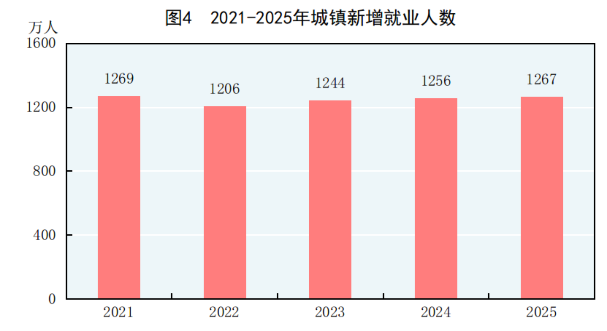

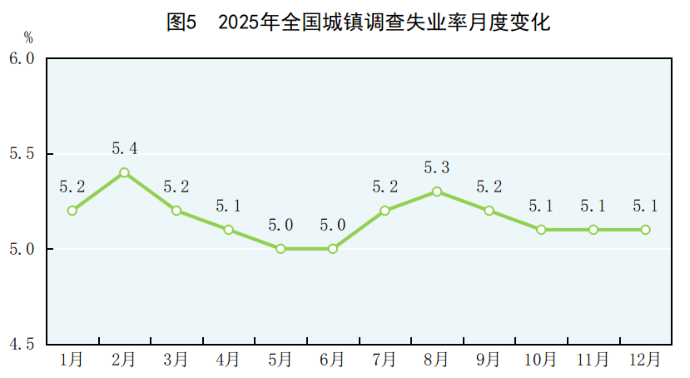

全年居民消费价格与上年持平。工业生产者出厂价格下降2.6%。工业生产者购进价格下降3.0%。农产品生产者价格[9]下降3.7%。12月份，70个大中城市中，新建商品住宅销售价格环比上涨的城市个数为6个，持平的为6个，下降的为58个；二手住宅销售价格环比下降的城市个数为70个；新建商品住宅销售价格同比上涨的城市个数为5个，下降的为65个；二手住宅销售价格同比下降的城市个数为70个。

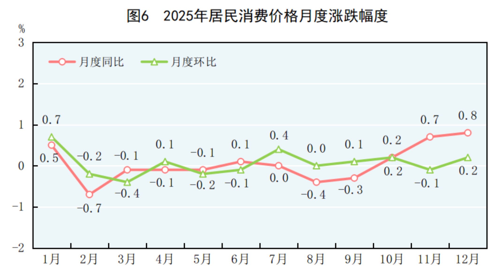

### 表2　2025年居民消费价格比上年涨跌幅度

| 单位：%        | 全国 | 城市 | 农村 |
| -------------- | ---- | ---- | ---- |
| 居民消费价格   | 0.0  | 0.1  | -0.2 |
| 其中：食品烟酒 | -0.7 | -0.5 | -1.2 |
| 衣着           | 1.5  | 1.7  | 1.0  |
| 居住[10]       | 0.1  | 0.2  | -0.2 |
| 生活用品及服务 | 0.9  | 0.8  | 1.2  |
| 交通通信       | -2.6 | -2.7 | -2.5 |
| 教育文化娱乐   | 0.8  | 0.8  | 1.0  |
| 医疗保健       | 0.8  | 0.5  | 1.3  |
| 其他用品及服务 | 9.3  | 9.5  | 8.3  |

年末国家外汇储备33579亿美元，比上年末增加1555亿美元。全年人民币平均汇率为1美元兑7.1429元人民币，比上年贬值0.3%。

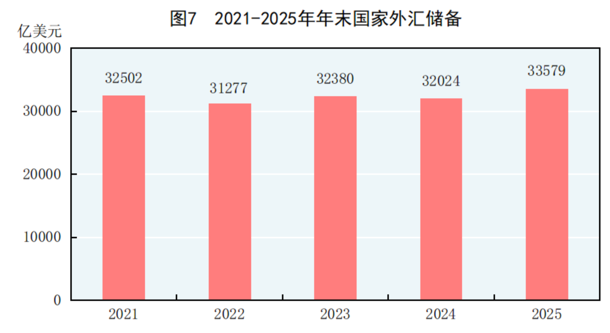

新质生产力稳步成长。全年规模以上工业[11]中，装备制造业[12]增加值比上年增长9.2%，占规模以上工业增加值比重为36.8%；装备制造业企业利润增长7.7%。高技术制造业[13]增加值增长9.4%，占规模以上工业增加值比重为17.1%；高技术制造业企业利润增长13.3%。数字产品制造业[14]增加值增长9.3%，占规模以上工业增加值比重为12.5%。服务机器人产量1858.1万套，比上年增长16.1%；移动通信基站设备产量536.4万射频模块，增长13.5%；服务器产量597.0万台，增长12.6%。部分服务行业规模以上企业[15]中，战略性新兴服务业[16]企业营业收入比上年增长9.3%，高技术服务业[17]企业营业收入增长7.9%。电子商务交易额[18]467339亿元，比上年增长2.5%。网上零售额[19]159722亿元，比上年增长8.6%。固定资产投资（不含农户）[20]中，设备工器具购置投资比上年增长11.8%。全年新设经营主体2574万户，日均新设企业2.6万户。

城乡融合和区域协调发展扎实推进。年末全国常住人口城镇化率为67.89%，比上年末提高0.89个百分点。分区域看[21]，全年东部地区生产总值730876亿元，比上年增长5.0%；中部地区生产总值299108亿元，增长5.2%；西部地区生产总值298750亿元，增长5.1%；东北地区生产总值65035亿元，增长4.1%。全年京津冀地区生产总值119918亿元，比上年增长5.4%；长江经济带地区生产总值658336亿元，增长5.2%；长三角地区生产总值346595亿元，增长5.4%。粤港澳大湾区建设、黄河流域生态保护和高质量发展等区域重大战略实施取得新进展。海南自由贸易港启动全岛封关运作。

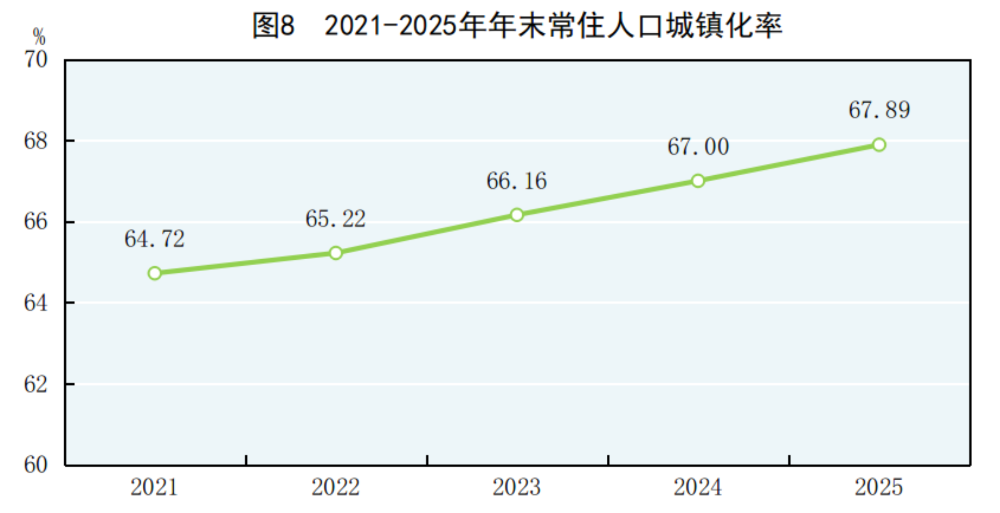

绿色低碳转型成效突出。初步测算，全年全国万元国内生产总值二氧化碳排放[22]比上年下降5.0%。水电、核电、风电、太阳能发电等清洁能源发电量42481亿千瓦时，比上年增长14.4%。新能源汽车产量1652.4万辆，比上年增长25.1%；年末新能源汽车保有量4397万辆，比上年末增加1257万辆。在监测的339个地级及以上城市中，空气质量达标的城市占72.6%。3641个国家地表水考核断面中，水质优良（Ⅰ～Ⅲ类）断面比例为91.4%，Ⅳ类断面比例为6.9%，Ⅴ类断面比例为1.1%，劣Ⅴ类断面比例为0.6%。

## 二、农业

全年粮食播种面积11941万公顷，比上年增加9万公顷。其中，稻谷播种面积2901万公顷，增加1万公顷；小麦播种面积2358万公顷，减少1万公顷；玉米播种面积4496万公顷，增加22万公顷；大豆播种面积1026万公顷，减少7万公顷。棉花播种面积298万公顷，增加14万公顷。油料播种面积1445万公顷，增加16万公顷。糖料播种面积149万公顷，增加3万公顷。

全年粮食产量71488万吨，比上年增加838万吨，增产1.2%。其中，夏粮产量14975万吨，减产0.1%；早稻产量2851万吨，增产1.2%；秋粮产量53662万吨，增产1.5%。谷物产量66021万吨，比上年增产1.2%。其中，稻谷产量20904万吨，增产0.7%；小麦产量14007万吨，基本持平；玉米产量30124万吨，增产2.1%。大豆产量2091万吨，比上年增产1.3%。

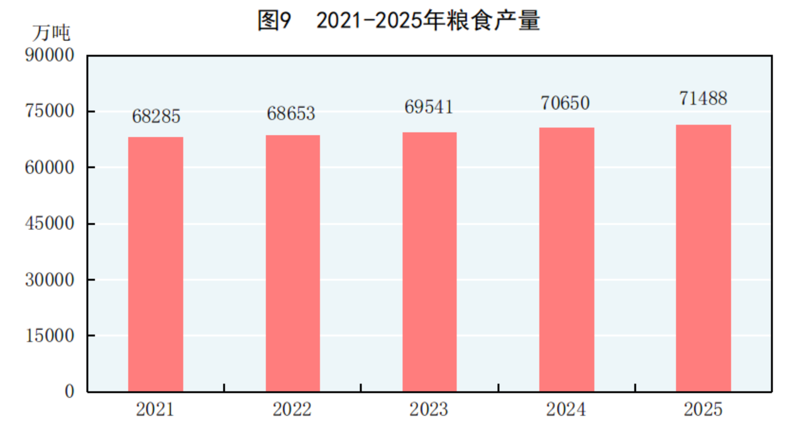

全年棉花产量664万吨，比上年增产7.7%。油料产量4096万吨，增产2.9%。糖料产量11701万吨，增产2.1%。茶叶产量392万吨，增产4.8%。

全年猪牛羊禽肉产量10072万吨，比上年增长4.2%。其中，猪肉产量5938万吨，增长4.1%；牛肉产量801万吨，增长2.8%；羊肉产量496万吨，下降4.2%；禽肉产量2837万吨，增长6.7%。禽蛋产量3498万吨，下降2.5%。牛奶产量4091万吨，增长0.3%。年末生猪存栏42967万头，比上年末增长0.5%；全年生猪出栏71973万头，比上年增长2.4%。

全年水产品总产量7657万吨，比上年增长4.1%。其中，养殖产量6324万吨，增长4.4%；捕捞产量1333万吨，增长2.7%。

全年木材产量13937万立方米，比上年下降1.1%。

## 三、工业和建筑业

全年全部工业增加值416826亿元，比上年增长5.8%。规模以上工业增加值增长5.9%。在规模以上工业中，分经济类型看，国有控股企业增加值增长4.6%；股份制企业增长6.3%，外商及港澳台投资企业增长3.9%；私营企业增长5.3%。分门类看，采矿业增长5.6%，制造业增长6.4%，电力、热力、燃气及水生产和供应业增长2.3%。

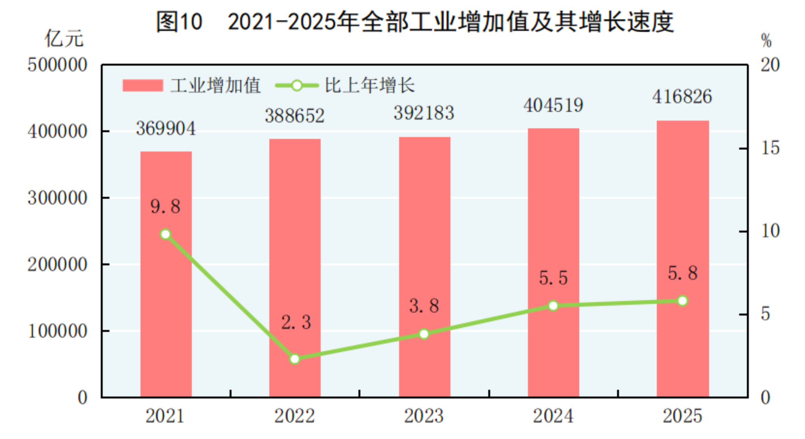

全年规模以上工业中，农副食品加工业增加值比上年增长5.6%，纺织业增长3.0%，化学原料和化学制品制造业增长7.8%，非金属矿物制品业下降0.6%，黑色金属冶炼和压延加工业增长4.5%，通用设备制造业增长8.0%，专用设备制造业增长4.3%，汽车制造业增长11.5%，电气机械和器材制造业增长9.2%，计算机、通信和其他电子设备制造业增长10.6%，电力、热力生产和供应业增长2.2%。

### 表3　2025年规模以上工业主要产品产量及其增长速度[23]

| 产品名称               | 单位     | 产量     | 比上年增长（%） |
| ---------------------- | -------- | -------- | --------------- |
| 纱                     | 万吨     | 2215.8   | -0.1            |
| 布                     | 亿米     | 306.7    | 0.2             |
| 化学纤维               | 万吨     | 8701.1   | 4.9             |
| 成品糖                 | 万吨     | 1621.0   | 9.0             |
| 卷烟                   | 亿支     | 24703.9  | 0.2             |
| 彩色电视机             | 万台     | 20273.9  | -2.6            |
| 家用电冰箱             | 万台     | 10924.4  | 1.6             |
| 房间空气调节器         | 万台     | 26697.5  | 0.7             |
| 粗钢                   | 万吨     | 96081.2  | -4.4            |
| 钢材[24]               | 万吨     | 144612.1 | 3.1             |
| 十种有色金属           | 万吨     | 8175.0   | 3.9             |
| 其中：精炼铜（电解铜） | 万吨     | 1472.0   | 10.4            |
| 原铝（电解铝）         | 万吨     | 4501.6   | 2.4             |
| 水泥                   | 亿吨     | 16.9     | -6.9            |
| 硫酸（折100%）         | 万吨     | 11081.6  | 4.5             |
| 烧碱（折100%）         | 万吨     | 4653.5   | 5.0             |
| 乙烯                   | 万吨     | 4150.8   | 6.4             |
| 化肥（折100%）         | 万吨     | 6480.8   | 7.1             |
| 发电机组（发电设备）   | 万千瓦   | 37087.4  | 37.6            |
| 汽车                   | 万辆     | 3477.8   | 9.8             |
| 其中：新能源汽车       | 万辆     | 1652.4   | 25.1            |
| 集成电路               | 亿块     | 4842.8   | 10.9            |
| 移动通信手持机         | 万台     | 154123.9 | -5.8            |
| 微型计算机设备         | 万台     | 33186.1  | -2.9            |
| 工业机器人             | 万套     | 77.3     | 28.0            |
| 太阳能工业用超白玻璃   | 万平方米 | 316135.4 | 3.4             |
| 充电桩                 | 万个     | 574.5    | 11.0            |
| 太阳能电池（光伏电池） | 万千瓦   | 83274.3  | 7.6             |
| 3D打印设备             | 万台     | 521.1    | 52.5            |

全年规模以上工业企业利润[25]73982亿元，比上年增长0.6%。分经济类型看，国有控股企业利润20561亿元，比上年下降3.9%；股份制企业55408亿元，下降0.1%，外商及港澳台投资企业17447亿元，增长4.2%；私营企业22811亿元，与上年持平。分门类看，采矿业利润8345亿元，比上年下降26.2%；制造业56916亿元，增长5.0%；电力、热力、燃气及水生产和供应业8721亿元，增长9.4%。规模以上工业企业每百元营业收入中的成本为85.31元，比上年增加0.16元；营业收入利润率为5.31%，下降0.03个百分点。年末规模以上工业企业资产负债率为57.6%，比上年末下降0.1个百分点。全年规模以上工业产能利用率[26]为74.4%。

初步核算，全年一次能源生产总量51.3亿吨标准煤，比上年增长3.6%。

### 表4　2025年主要能源产品产量及其增长速度

| 产品名称       | 单位     | 产量     | 比上年增长（%） |
| -------------- | -------- | -------- | --------------- |
| 原煤           | 亿吨     | 48.5     | 1.4             |
| 原油           | 万吨     | 21608.7  | 1.5             |
| 天然气         | 亿立方米 | 2620.6   | 6.3             |
| 发电量         | 亿千瓦时 | 105752.5 | 4.8             |
| 其中：火电[27] | 亿千瓦时 | 63271.5  | -0.7            |
| 水电           | 亿千瓦时 | 14616.7  | 2.5             |
| 核电           | 亿千瓦时 | 4852.3   | 7.6             |
| 风电           | 亿千瓦时 | 11279.2  | 13.1            |
| 太阳能发电     | 亿千瓦时 | 11732.4  | 39.8            |

年末全国发电装机容量389134万千瓦，比上年末增长16.1%。其中[28]，火电装机容量153904万千瓦，增长6.3%；水电装机容量44802万千瓦，增长2.9%；核电装机容量6248万千瓦，增长2.7%；风电装机容量64001万千瓦，增长22.9%；太阳能发电装机容量120173万千瓦，增长35.4%。

全年建筑业增加值86425亿元，比上年下降1.1%。全国具有资质等级的总承包和专业承包建筑业企业利润6355亿元，比上年下降[29]14.1%，其中国有控股企业利润3473亿元，下降8.2%。

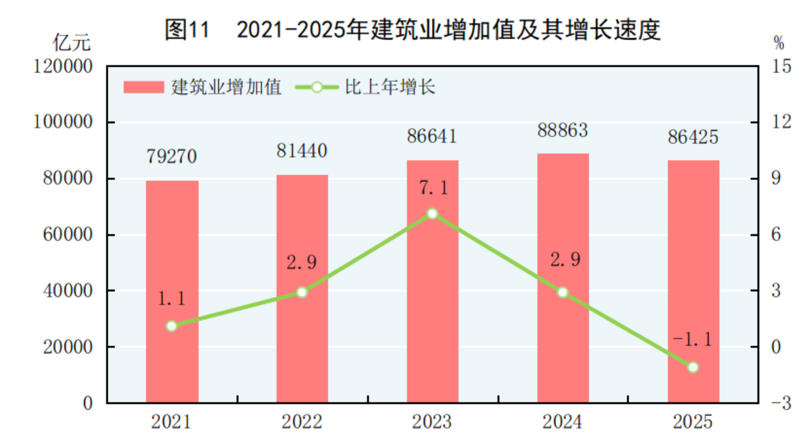

## 四、服务业

全年批发和零售业增加值145808亿元，比上年增长5.0%；交通运输、仓储和邮政业增加值62092亿元，增长5.2%；住宿和餐饮业增加值26403亿元，增长4.9%；金融业增加值101337亿元，增长4.5%；房地产业增加值83024亿元，增长0.2%；信息传输、软件和信息技术服务业增加值70599亿元，增长11.1%；租赁和商务服务业增加值63666亿元，增长10.3%。部分服务行业规模以上企业[30]营业收入比上年增长6.8%，利润总额增长1.9%。

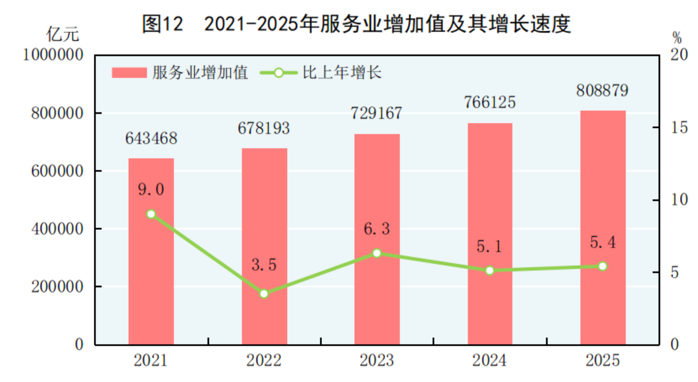

全年货物运输总量[31]597亿吨，比上年增长3.2%。货物运输周转量274116亿吨公里，增长4.6%。港口完成货物吞吐量183亿吨，比上年增长4.2%，其中外贸货物吞吐量57亿吨，增长4.7%。港口集装箱吞吐量35447万标准箱，增长6.8%。

### 表5　2025年各种运输方式完成货物运输量及其增长速度

| 指标           | 单位     | 绝对数   | 比上年增长（%） |
| -------------- | -------- | -------- | --------------- |
| 货物运输总量   | 亿吨     | 596.7    | 3.2             |
| 铁路           | 亿吨     | 52.8     | 2.0             |
| 公路           | 亿吨     | 432.9    | 3.4             |
| 水路           | 亿吨     | 101.2    | 3.2             |
| 民航           | 万吨     | 1017.2   | 13.3            |
| 管道           | 亿吨     | 9.7      | 1.1             |
| 货物运输周转量 | 亿吨公里 | 274115.8 | 4.6             |
| 铁路           | 亿吨公里 | 36869.1  | 2.8             |
| 公路           | 亿吨公里 | 79510.7  | 3.5             |
| 水路           | 亿吨公里 | 149943.9 | 6.0             |
| 民航           | 亿吨公里 | 413.1    | 16.7            |
| 管道           | 亿吨公里 | 7379.0   | -1.2            |

全年旅客运输总量[32]171亿人次，比上年增长0.3%。旅客运输周转量35546亿人公里，增长5.0%。

### 表6　2025年各种运输方式完成旅客运输量及其增长速度

| 指标           | 单位     | 绝对数  | 比上年增长（%） |
| -------------- | -------- | ------- | --------------- |
| 旅客运输总量   | 亿人次   | 171.2   | 0.3             |
| 铁路           | 亿人次   | 46.0    | 6.7             |
| 公路           | 亿人次   | 114.9   | -2.4            |
| 水路           | 亿人次   | 2.6     | -0.1            |
| 民航           | 亿人次   | 7.7     | 5.5             |
| 旅客运输周转量 | 亿人公里 | 35545.6 | 5.0             |
| 铁路           | 亿人公里 | 16395.6 | 3.8             |
| 公路           | 亿人公里 | 5100.4  | 0.0             |
| 水路           | 亿人公里 | 56.6    | 3.6             |
| 民航           | 亿人公里 | 13993.0 | 8.3             |

年末全国民用汽车保有量36611万辆（包括三轮汽车和低速货车681万辆），比上年末增加1343万辆，其中私人汽车保有量32336万辆，增加1348万辆。民用轿车保有量19773万辆，增加429万辆，其中私人轿车保有量18691万辆，增加487万辆。

全年完成邮政行业寄递业务总量[33]2165亿件，比上年增长11.8%。邮政业完成邮政函件业务6.8亿件，包裹业务0.3亿件，快递业务量1990亿件，快递业务收入14939亿元。全年完成电信业务总量[34]18627亿元，比上年增长9.1%。年末移动电话基站数[35]1287万个，其中4G基站719万个，5G基站484万个。全国移动电话用户182684万户，其中5G移动电话用户120413万户。移动电话普及率为130.0部/百人。固定互联网宽带接入用户[36]69082万户，比上年末增加2099万户，其中1000M速率及以上的宽带接入用户[37]23839万户，增加3157万户。移动物联网终端用户[38]28.88亿户，增加2.32亿户。互联网上网人数11.25亿人，其中手机上网人数11.21亿人。互联网普及率为80.1%，其中农村地区互联网普及率为69.5%。全年移动互联网用户接入流量3958亿GB，比上年增长17.3%。软件和信息技术服务业[39]完成软件业务收入154831亿元，比上年增长13.2%。

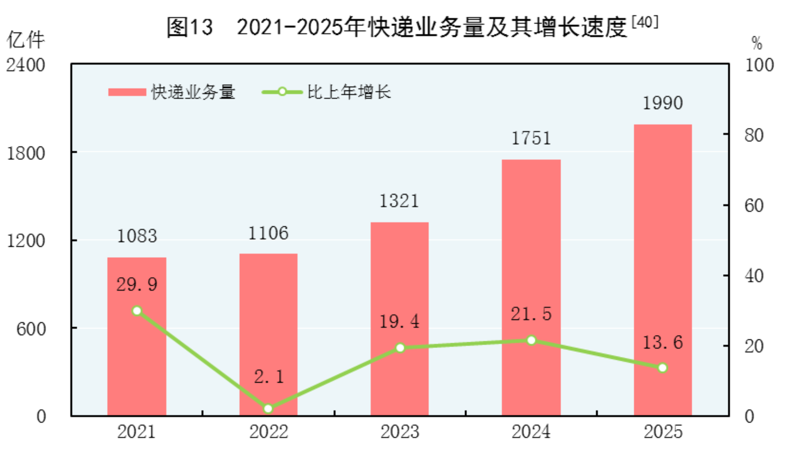

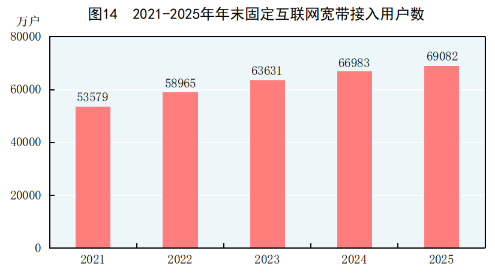

## 五、国内贸易

全年社会消费品零售总额501202亿元，比上年增长3.7%。按经营地分，城镇消费品零售额432972亿元，增长3.6%；乡村消费品零售额68230亿元，增长4.1%。按消费类型分，商品零售额443220亿元，增长3.8%；餐饮收入57982亿元，增长3.2%。服务零售额[41]比上年增长5.5%。

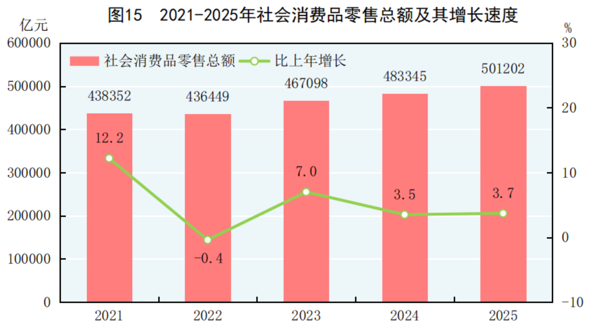

全年限额以上单位商品零售额中，粮油、食品类零售额比上年增长9.3%，饮料类增长1.0%，烟酒类增长2.7%，服装、鞋帽、针纺织品类增长3.2%，化妆品类增长5.1%，金银珠宝类增长12.8%，日用品类增长6.3%，体育、娱乐用品类增长15.7%，家用电器和音像器材类增长11.0%，中西药品类增长1.8%，文化办公用品类增长17.3%，家具类增长14.6%，通讯器材类增长20.9%，石油及制品类下降5.7%，汽车类下降1.5%，建筑及装潢材料类下降2.7%。按零售业态分，限额以上零售业单位中，便利店零售额比上年增长5.5%，专业店增长2.6%，超市增长4.3%，百货店增长0.1%，品牌专卖店下降0.6%。

全年实物商品网上零售额[42]130923亿元，比上年增长5.2%，占社会消费品零售总额比重为26.1%。

## 六、固定资产投资

全年全社会固定资产投资491109亿元，比上年下降[43]3.9%。固定资产投资（不含农户）485186亿元，下降3.8%。在固定资产投资（不含农户）中，分区域看[44]，东部地区投资下降8.4%，中部地区投资下降2.7%，西部地区投资下降1.3%，东北地区投资下降15.5%。

在固定资产投资（不含农户）中，第一产业投资9570亿元，比上年增长2.3%；第二产业投资177368亿元，增长2.5%；第三产业投资298248亿元，下降7.4%。基础设施投资[45]下降2.2%。社会领域投资[46]下降8.5%。民间投资[47]下降6.4%，扣除房地产开发民间投资的民间项目投资下降1.9%。分领域看，制造业民间投资下降0.2%，基础设施民间投资增长1.7%。

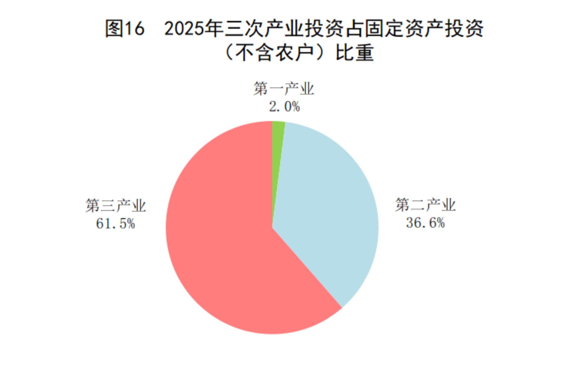

### 表7　2025年分行业固定资产投资（不含农户）增长速度

| 行业                             | 比上年增长（%） | 行业                         | 比上年增长（%） |
| -------------------------------- | --------------- | ---------------------------- | --------------- |
| 总计                             | -3.8            | 金融业                       | 7.2             |
| 农、林、牧、渔业                 | -0.8            | 房地产业[48]                 | -17.5           |
| 采矿业                           | 2.5             | 租赁和商务服务业             | -4.3            |
| 制造业                           | 0.6             | 科学研究和技术服务业         | -15.1           |
| 电力、热力、燃气及水生产和供应业 | 9.1             | 水利、环境和公共设施管理业   | -8.4            |
| 建筑业                           | -22.2           | 居民服务、修理和其他服务业   | 0.9             |
| 批发和零售业                     | 5.6             | 教育                         | -8.3            |
| 交通运输、仓储和邮政业           | -1.2            | 卫生和社会工作               | -12.3           |
| 住宿和餐饮业                     | 5.5             | 文化、体育和娱乐业           | -3.8            |
| 信息传输、软件和信息技术服务业   | 8.8             | 公共管理、社会保障和社会组织 | 5.7             |

### 表8　2025年固定资产投资新增主要生产与运营能力

| 指标                                 | 单位     | 绝对数 |
| ------------------------------------ | -------- | ------ |
| 新增220千伏及以上交流变电设备容量    | 万千伏安 | 32043  |
| 新建铁路投产里程                     | 公里     | 3109   |
| 其中：高速铁路                       | 公里     | 2862   |
| 增、新建铁路复线投产里程             | 公里     | 2941   |
| 电气化铁路投产里程                   | 公里     | 3091   |
| 新改建高速公路里程                   | 公里     | 8699   |
| 港口万吨级及以上码头泊位新增通过能力 | 万吨/年  | 38833  |
| 新增民用运输机场                     | 个       | 7      |
| 新增光缆线路长度                     | 万公里   | 211    |

全年房地产开发投资82788亿元，比上年下降[49]17.2%。其中住宅投资63514亿元，下降16.3%；办公楼投资3203亿元，下降22.8%；商业营业用房投资5947亿元，下降14.0%。全年新建商品房销售面积[50]88101万平方米。二手房交易网签面积[51]73685万平方米。年末新建商品房待售面积76632万平方米，其中商品住宅待售面积40236万平方米。

### 表9　2025年房地产开发和销售主要指标及其增长速度

| 指标                       | 单位     | 绝对数 | 比上年增长（%） |
| -------------------------- | -------- | ------ | --------------- |
| 房地产开发投资             | 亿元     | 82788  | -17.2           |
| 其中：住宅                 | 亿元     | 63514  | -16.3           |
| 房屋施工面积               | 万平方米 | 659890 | -10.0           |
| 其中：住宅                 | 万平方米 | 460123 | -10.3           |
| 房屋新开工面积             | 万平方米 | 58770  | -20.4           |
| 其中：住宅                 | 万平方米 | 42984  | -19.8           |
| 房屋竣工面积               | 万平方米 | 60348  | -18.1           |
| 其中：住宅                 | 万平方米 | 42830  | -20.2           |
| 新建商品房销售面积         | 万平方米 | 88101  | -8.7            |
| 其中：住宅                 | 万平方米 | 73299  | -9.2            |
| 房地产开发企业本年到位资金 | 亿元     | 93117  | -13.4           |
| 其中：国内贷款             | 亿元     | 14094  | -7.3            |
| 个人按揭贷款               | 亿元     | 12852  | -17.8           |

全年全国配售型保障性住房、保障性租赁住房和公租房等开工建设和筹集121万套（间）；城市危旧房改造开工17万套；新开工改造城镇老旧小区2.7万个，惠及居民499万户；农村低收入群体等重点对象农村危房改造和农房抗震改造开工21.9万户。

## 七、对外经济

全年货物进出口总额454685亿元，比上年增长3.8%。其中，出口269890亿元，增长6.1%；进口184795亿元，增长0.5%。货物进出口顺差85094亿元。对共建“一带一路”国家进出口额236018亿元，比上年增长6.3%，占进出口总额比重为51.9%。其中，出口136851亿元，增长11.2%；进口99167亿元，增长0.1%。对《区域全面经济伙伴关系协定》（RCEP）其他成员国[52]进出口额138503亿元，比上年增长5.3%。民营企业进出口额260403亿元，比上年增长7.1%，占进出口总额比重为57.3%；其中出口176592亿元，增长7.2%。

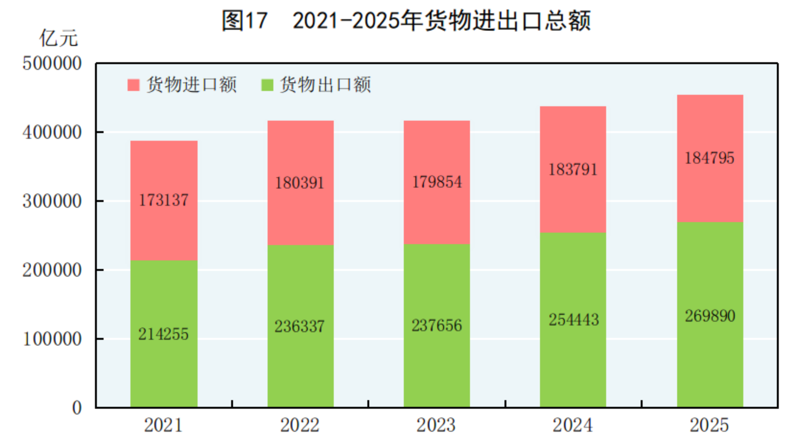

### 表10　2025年货物进出口总额及其增长速度

| 指标           | 金额（亿元） | 比上年增长（%） |
| -------------- | ------------ | --------------- |
| 货物进出口总额 | 454685       | 3.8             |
| 货物出口额     | 269890       | 6.1             |
| 其中：一般贸易 | 176411       | 6.0             |
| 加工贸易       | 52633        | 4.9             |
| 其中：机电产品 | 164683       | 8.9             |
| 高新技术产品   | 67806        | 8.0             |
| 货物进口额     | 184795       | 0.5             |
| 其中：一般贸易 | 110650       | -3.7            |
| 加工贸易       | 32527        | 12.7            |
| 其中：机电产品 | 74069        | 5.7             |
| 高新技术产品   | 58844        | 9.9             |
| 货物进出口顺差 | 85094        | 20.4            |

### 表11　2025年主要商品出口数量、金额及其增长速度

| 商品名称 | 单位 | 数量 | 比上年增长（%） | 金额（亿元） | 比上年增长（%） |
| --- | --- | --- | --- | --- | --- |
| 钢材 | 万吨 | 11902 | 7.5 | 5911 | -0.7 |
| 纺织纱线、织物及其制品 | — | — | — | 10205 | 1.0 |
| 服装及衣着附件 | — | — | — | 10822 | -4.4 |
| 鞋靴 | 亿双 | 90 | -2.0 | 2975 | -10.8 |
| 家具及其零件 | — | — | — | 4559 | -5.6 |
| 箱包及类似容器 | 万吨 | 368 | 1.6 | 2140 | -12.9 |
| 玩具 | — | — | — | 2493 | -12.1 |
| 塑料制品 | — | — | — | 7487 | -0.8 |
| 集成电路 | 亿个 | 3495 | 17.4 | 14442 | 27.4 |
| 自动数据处理设备及其零部件 | — | — | — | 14530 | -0.8 |
| 手机 | 万台 | 75118 | -7.7 | 8696 | -9.0 |
| 集装箱 | 万个 | 458 | -15.9 | 972 | -19.9 |
| 液晶平板显示模组 | 万个 | 209492 | 10.7 | 2306 | 11.7 |
| 汽车（包括底盘） | 万辆 | 832 | 30.0 | 10183 | 22.0 |

### 表12　2025年主要商品进口数量、金额及其增长速度

| 商品名称 | 单位 | 数量 | 比上年增长（%） | 金额（亿元） | 比上年增长（%） |
| --- | --- | --- | --- | --- | --- |
| 大豆 | 万吨 | 11183 | 6.5 | 3602 | -3.9 |
| 食用植物油 | 万吨 | 694 | -3.2 | 616 | 16.6 |
| 铁矿砂及其精矿 | 万吨 | 125871 | 1.8 | 8804 | -6.6 |
| 煤及褐煤 | 万吨 | 49027 | -9.6 | 2586 | -30.2 |
| 原油 | 万吨 | 57773 | 4.4 | 21217 | -8.3 |
| 成品油 | 万吨 | 4242 | -12.0 | 1718 | -17.7 |
| 天然气 | 万吨 | 12787 | -2.8 | 4060 | -12.5 |
| 初级形状的塑料 | 万吨 | 2684 | -7.4 | 2843 | -8.8 |
| 纸浆 | 万吨 | 3604 | 4.9 | 1566 | -1.7 |
| 钢材 | 万吨 | 606 | -11.1 | 735 | -10.2 |
| 未锻轧铜及铜材 | 万吨 | 532 | -6.4 | 3869 | 0.7 |
| 集成电路 | 亿个 | 5917 | 7.8 | 30355 | 10.7 |
| 汽车（包括底盘） | 万辆 | 48 | -32.4 | 1693 | -39.2 |

### 表13　2025年对主要国家和地区货物进出口金额、增长速度及其比重

| 国家和地区 | 出口额（亿元） | 比上年增长（%） | 占全部出口比重（%） | 进口额（亿元） | 比上年增长（%） | 占全部进口比重（%） |
| --- | --- | --- | --- | --- | --- | --- |
| 东盟 | 47596 | 14.0 | 17.6 | 27861 | -1.0 | 15.1 |
| 欧盟 | 40071 | 9.0 | 14.8 | 19182 | 0.1 | 10.4 |
| 美国 | 30067 | -19.5 | 11.1 | 10000 | -14.1 | 5.4 |
| 中国香港 | 24001 | 16.1 | 8.9 | 2266 | 73.4 | 1.2 |
| 韩国 | 10319 | -0.6 | 3.8 | 13379 | 3.6 | 7.2 |
| 日本 | 11261 | 4.1 | 4.2 | 11792 | 6.1 | 6.4 |
| 中国台湾 | 5982 | 11.8 | 2.2 | 16509 | 6.5 | 8.9 |
| 俄罗斯 | 7384 | -9.9 | 2.7 | 8924 | -3.4 | 4.8 |
| 巴西 | 5123 | -0.1 | 1.9 | 8328 | 0.8 | 4.5 |
| 印度 | 9723 | 13.4 | 3.6 | 1412 | 10.3 | 0.8 |
| 南非 | 1645 | 6.0 | 0.6 | 2188 | 0.5 | 1.2 |

全年服务进出口总额80823亿元，比上年增长7.4%。其中，出口36268亿元，增长14.2%；进口44555亿元，增长2.5%。服务进出口逆差8287亿元。

全年新设立外商投资企业70392家，比上年增长19.1%。实际使用外资金额7477亿元，下降9.5%。其中，共建“一带一路”国家（含通过部分自由港对华投资）对华新设立外商投资企业19756家，增长14.7%；对华直接投资1168亿元，增长1.9%。高技术产业实际使用外资2418亿元，下降15.6%。

### 表14　2025年外商直接投资额及其增长速度

| 行业 | 企业数（家） | 比上年增长（%） | 实际使用金额（亿元） | 比上年增长（%） |
| --- | --- | --- | --- | --- |
| 总计 | 70392 | 19.1 | 7477 | -9.5 |
| 其中：农、林、牧、渔业 | 366 | -2.1 | 15 | -44.5 |
| 制造业 | 4244 | 9.6 | 1855 | -16.1 |
| 电力、热力、燃气及水生产和供应业 | 313 | -28.7 | 243 | -14.5 |
| 交通运输、仓储和邮政业 | 1054 | 25.8 | 88 | -21.1 |
| 信息传输、软件和信息技术服务业 | 5567 | 39.6 | 440 | -16.3 |
| 批发和零售业 | 25053 | 20.1 | 514 | -11.9 |
| 房地产业 | 624 | 2.0 | 218 | -46.2 |
| 租赁和商务服务业 | 12757 | 14.3 | 1896 | 4.5 |
| 居民服务、修理和其他服务业 | 1104 | 28.5 | 20 | -43.3 |

全年对外非金融类直接投资额10404亿元，比上年增长1.6%。其中，对共建“一带一路”国家非金融类直接投资额2834亿元，增长18.0%。

### 表15　2025年对外非金融类直接投资额及其增长速度

| 行业 | 金额（亿元） | 比上年增长（%） |
| --- | --- | --- |
| 总计 | 10404 | 1.6 |
| 其中：农、林、牧、渔业 | 151 | 54.1 |
| 采矿业 | 801 | -10.3 |
| 制造业 | 2011 | -4.6 |
| 电力、热力、燃气及水生产和供应业 | 143 | -69.0 |
| 建筑业 | 299 | 4.2 |
| 批发和零售业 | 2555 | 27.3 |
| 交通运输、仓储和邮政业 | 709 | 34.8 |
| 信息传输、软件和信息技术服务业 | 369 | -11.1 |
| 房地产业 | 89 | -27.5 |
| 租赁和商务服务业 | 2719 | -5.6 |

全年对外承包工程完成营业额12773亿元，比上年增长8.1%。其中，对共建“一带一路”国家完成营业额10902亿元，增长9.6%，占对外承包工程完成营业额比重为85.4%。对外劳务合作派出各类劳务人员43万人。

## 八、财政金融

全年全国一般公共预算收入216045亿元，比上年下降1.7%；其中税收收入176363亿元，增长0.8%。全国一般公共预算支出287395亿元，比上年增长1.0%。全年现行支持科技创新和制造业发展的主要政策减税降费及退税金额28557亿元。

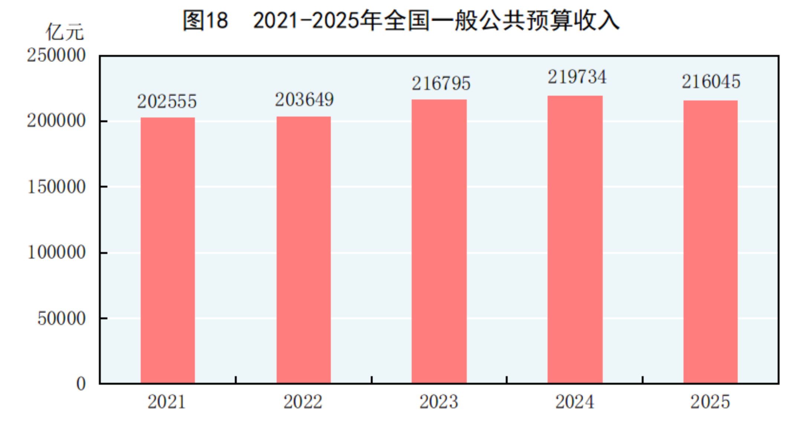

注：图中2021年至2024年数据为全国一般公共预算收入决算数，2025年为执行数。

年末广义货币供应量（M2）余额340.3万亿元，比上年末增长8.5%；狭义货币供应量（M1）[53]余额115.5万亿元，增长3.8%；流通中货币（M0）余额14.1万亿元，增长10.2%。

全年社会融资规模增量[54]35.6万亿元，按可比口径计算，比上年多3.3万亿元。年末社会融资规模存量[55]442.1万亿元，按可比口径计算，比上年末增长8.3%，其中对实体经济发放的人民币贷款余额268.4万亿元，增长6.3%。年末全部金融机构本外币各项存款余额336.1万亿元，比年初增加27.8万亿元，其中人民币各项存款余额328.6万亿元，增加26.4万亿元。全部金融机构本外币各项贷款余额275.7万亿元，增加16.2万亿元，其中人民币各项贷款余额271.9万亿元，增加16.3万亿元。人民币普惠小微贷款[56]余额36.6万亿元，增加3.6万亿元。本外币涉农贷款余额53.6万亿元，增加3.4万亿元；制造业中长期贷款余额14.9万亿元，增加1.0万亿元；绿色贷款余额44.8万亿元，增加7.7万亿元。全年全国新发放企业贷款加权平均利率[57]3.22%，比上年下降41个基点。

### 表16　2025年年末全部金融机构本外币存贷款余额及其增长速度

| 指标               | 年末数（亿元） | 比上年末增长（%） |
| ------------------ | -------------- | ----------------- |
| 各项存款           | 3361383        | 9.0               |
| 其中：境内住户存款 | 1670357        | 9.7               |
| 其中：人民币       | 1658935        | 9.7               |
| 境内非金融企业存款 | 844668         | 3.7               |
| 各项贷款           | 2757435        | 6.2               |
| 其中：境内短期贷款 | 691635         | 5.8               |
| 境内中长期贷款     | 1812965        | 5.8               |

年末主要农村金融机构（农村信用社、农村合作银行、农村商业银行）人民币贷款余额33.1万亿元，比年初增加1.6万亿元。全部金融机构人民币消费贷款余额58.2万亿元，减少0.5万亿元。其中，住户短期消费贷款余额9.5万亿元，减少0.7万亿元；住户中长期消费贷款余额48.7万亿元，增加0.2万亿元。

全年沪深交易所A股累计筹资[58]12583亿元，比上年增加8332亿元。沪深交易所首次公开发行上市A股90只，筹资1242亿元，比上年增加620亿元，其中科创板股票19只，筹资381亿元；沪深交易所A股再融资（包括公开增发、定向增发、配股、优先股、可转债转股）11341亿元，增加7712亿元。北京证券交易所公开发行股票26只，筹资[59]76亿元，再融资4亿元。全年各类主体通过沪深北交易所发行债券（包括公司债券、企业债券、资产支持证券、国债和地方政府债券）筹资16.3万亿元。沪深交易所共上市基础设施领域不动产投资信托基金（REITs）20只，募集资金402亿元。年末全国中小企业股份转让系统挂牌公司5960家，全年挂牌公司累计股票筹资[60]74亿元。

全年发行公司信用类债券[61]15.6万亿元，比上年增加0.9万亿元。

全年保险公司原保险保费收入[62]61194亿元，按可比口径计算，比上年增长7.4%。其中，寿险业务原保险保费收入35557亿元，健康险和意外伤害险业务原保险保费收入10935亿元，财产险业务原保险保费收入14703亿元。支付各类赔款及给付24432亿元。其中，寿险业务给付10016亿元，健康险和意外伤害险业务赔款及给付4454亿元，财产险业务赔款9962亿元。

## 九、居民收入消费和社会保障

全年全国居民人均可支配收入43377元，比上年增长5.0%，扣除价格因素，实际增长5.0%。全国居民人均可支配收入中位数[63]36231元，增长4.4%。按常住地分，城镇居民人均可支配收入56502元，比上年增长4.3%，扣除价格因素，实际增长4.2%。城镇居民人均可支配收入中位数51115元，增长3.7%。农村居民人均可支配收入24456元，比上年增长5.8%，扣除价格因素，实际增长6.0%。农村居民人均可支配收入中位数20711元，增长5.6%。城乡居民人均可支配收入比值为2.31，比上年缩小0.03。按全国居民五等份收入分组[64]，低收入组人均可支配收入10150元，中间偏下收入组人均可支配收入22702元，中间收入组人均可支配收入35536元，中间偏上收入组人均可支配收入55586元，高收入组人均可支配收入103778元。全国农民工人均月收入5075元，比上年增长2.3%。脱贫县[65]农村居民人均可支配收入18627元，比上年增长6.3%，扣除价格因素，实际增长6.5%。

全年全国居民人均消费支出29476元，比上年增长4.4%，扣除价格因素，实际增长4.4%。其中，人均服务性消费支出[66]13602元，比上年增长4.5%，占居民人均消费支出比重为46.1%。按常住地分，城镇居民人均消费支出35869元，增长3.8%，扣除价格因素，实际增长3.7%；农村居民人均消费支出20259元，增长5.1%，扣除价格因素，实际增长5.3%。全国居民恩格尔系数为29.3%，其中城镇为28.3%，农村为31.8%。

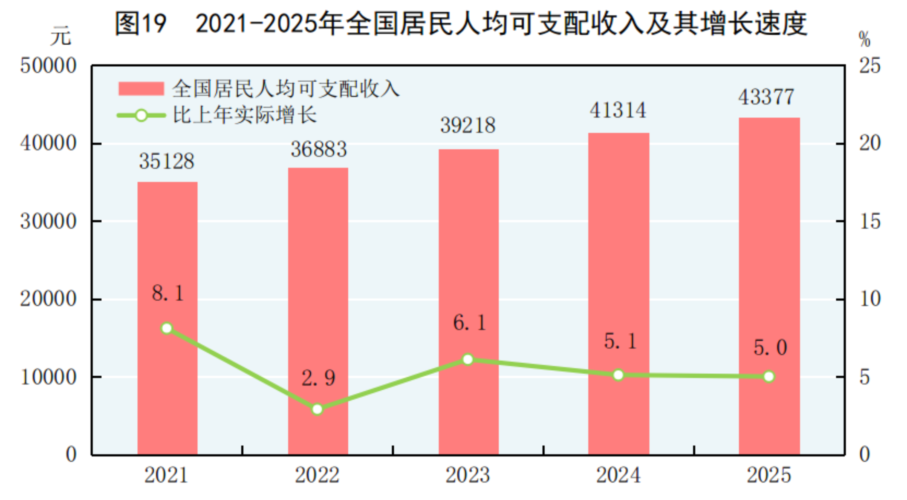

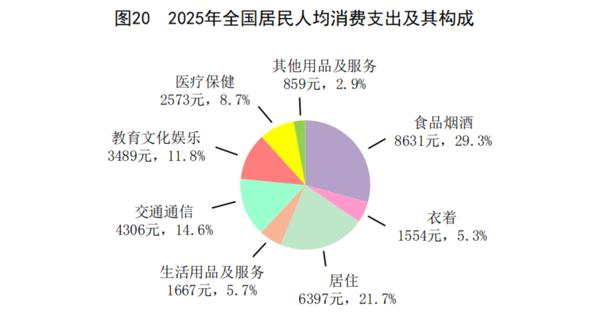

年末全国参加基本养老保险人数107599万人，比上年末增加316万人，其中参加城镇职工基本养老保险人数54680万人，参加城乡居民基本养老保险人数52919万人。参加基本医疗保险人数133068万人，增加406万人，其中参加职工基本医疗保险人数38856万人，参加城乡居民基本医疗保险人数94212万人。参加失业保险人数24918万人，增加329万人。参加工伤保险人数30500万人，增加102万人。参加生育保险人数25966万人，增加666万人。年末全国共有595万人享受城市最低生活保障，3340万人享受农村最低生活保障，445万人享受农村特困人员[67]救助供养，全年临时救助[68]2399万人次。全年领取国家定期抚恤金、定期生活补助金的退役军人和其他优抚对象813万人。

年末全国共有各类提供住宿的民政服务机构4.2万个，其中养老机构3.9万个，儿童福利和救助保护机构1196个。民政服务床位[69]794.0万张，其中养老服务床位768.0万张，儿童福利和救助保护机构床位9.6万张。

## 十、科学技术和教育

全年研究与试验发展（R&D）经费支出39262亿元，比上年增长8.1%，与国内生产总值之比为2.80%，其中基础研究经费2778亿元，比上年增长11.1%，占R&D经费支出比重为7.08%。国家自然科学基金共资助5.88万个项目。截至年末，纳入新序列管理的国家工程研究中心207个，国家发展改革委认定的企业技术中心1921家。国家科技成果转化引导基金累计设立36只子基金，资金总规模624亿元。全年授予发明专利权97.2万件，比上年下降7.0%。专利合作条约（PCT）专利申请受理量[70]7.8万件。截至年末，有效发明专利631.8万件，比上年末增长11.1%。每万人口高价值发明专利拥有量[71]16件。全年商标注册420.6万件，比上年下降12.0%。全年共签订技术合同104万项，技术合同成交金额75734亿元，比上年增长10.8%。我国公民具备科学素质[72]的比例达到16.74%。

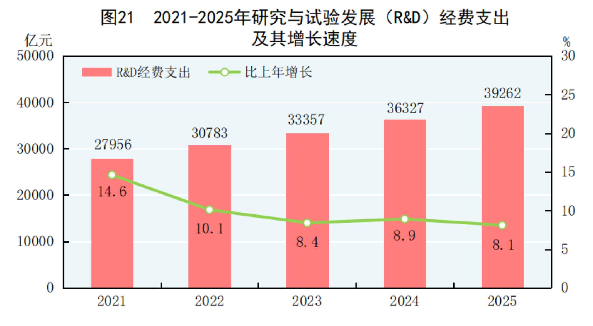

### 表17　2025年专利授权和有效专利情况

| 指标                   | 专利数（万件） | 比上年增长（%） |
| ---------------------- | -------------- | --------------- |
| 发明专利授权           | 97.2           | -7.0            |
| 其中：境内发明专利授权 | 89.7           | -3.7            |
| 实用新型专利授权       | 146.1          | -27.3           |
| 外观设计专利授权       | 66.6           | 3.6             |
| 年末有效发明专利       | 631.8          | 11.1            |
| 其中：境内有效发明专利 | 532.0          | 13.6            |
| 年末有效实用新型专利   | 1153.0         | -1.1            |
| 年末有效外观设计专利   | 317.1          | 3.2             |

全年完成92次宇航发射，其中商业航天发射50次。天问二号成功开启小行星采样返回之旅，可重复使用运载火箭技术加速突破，朱雀三号、长征十二号甲首飞实现二子级成功入轨。由我国完全自主设计建造的首艘电磁弹射型航空母舰“福建舰”入列。超导量子计算原型机“祖冲之三号”成功构建，我国“人造太阳”创造“亿度千秒”世界纪录，江门中微子实验大科学装置正式运行。国产人工智能大模型深度求索（DeepSeek）引发全球关注，首例侵入式脑机接口临床试验成功开展，自主研制的国内首台低温大束流离子注入机具备产业化能力。

年末全国共有国家质检中心874家。全国现有产品质量、体系和服务认证机构1216个，累计完成对117万家企业的认证。全年制定、修订国家标准4929项，其中新制定2481项。全年制造业产品质量合格率[73]为94.36%。

全年研究生教育招生143.8万人，在学研究生430.0万人，毕业生116.7万人。普通、职业本专科[74]招生1070.8万人，在校生3954.0万人，毕业生1105.1万人。中等职业教育[75]招生526.5万人，在校生1537.8万人，毕业生521.9万人。普通高中招生1074.9万人，在校生3039.5万人，毕业生924.6万人。初中招生1852.8万人，在校生5509.3万人，毕业生1723.7万人。小学招生1461.7万人，在校生10178.3万人，毕业生1860.5万人。特殊教育招生16.4万人，在校生92.7万人，毕业生18.4万人。学前教育在园幼儿3225.5万人。九年义务教育巩固率为96.1%，高中阶段毛入学率为92.0%。16—59岁人口平均受教育年限为11.3年，比上年提高0.1年。

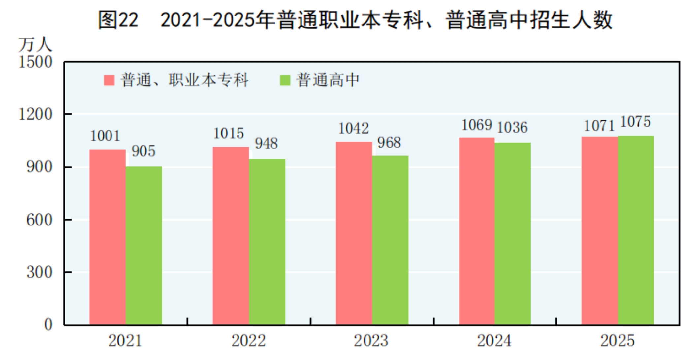

## 十一、文化旅游、卫生健康和体育

年末全国文化和旅游部门所属艺术表演团体1879个。全国共有公共图书馆3253个，总流通[76]146983万人次；文化馆3517个。有线电视实际用户2.07亿户，其中有线数字电视实际用户2.00亿户。年末广播节目综合人口覆盖率为99.8%，电视节目综合人口覆盖率为99.8%。全年制作发行电视剧110部3376集，电视动画片336部93874分钟。生产故事影片511部，科教、纪录、动画、虚拟现实[77]和特种影片[78]253部。出版各类报纸230亿份，各类期刊16亿册，图书108亿册（张），人均图书拥有量[79]7.71册（张）。年末全国共有档案馆4227个，已开放各类档案26726万卷（件）。全年全国规模以上文化及相关产业企业营业收入152135亿元，按可比口径计算，比上年增长7.4%，其中文化新业态特征较为明显的16个行业小类[80]企业营业收入增长14.3%。

全年国内出游65.2亿人次，比上年增长16.2%。其中，城镇居民国内出游50.0亿人次，增长14.3%；农村居民国内出游15.3亿人次，增长22.6%。国内游客出游总花费63003亿元，增长9.5%。其中，城镇居民出游花费52990亿元，增长7.5%；农村居民出游花费10012亿元，增长21.4%。入境游客15450万人次，增长17.1%，其中外国人3517万人次，香港、澳门和台湾同胞11932万人次。入境游客总花费1311亿美元，增长39.2%。通过免签入境外国人3008万人次，增长49.5%。内地居民出境16792万人次，其中因私出境16166万人次，赴港澳台出境11271万人次。

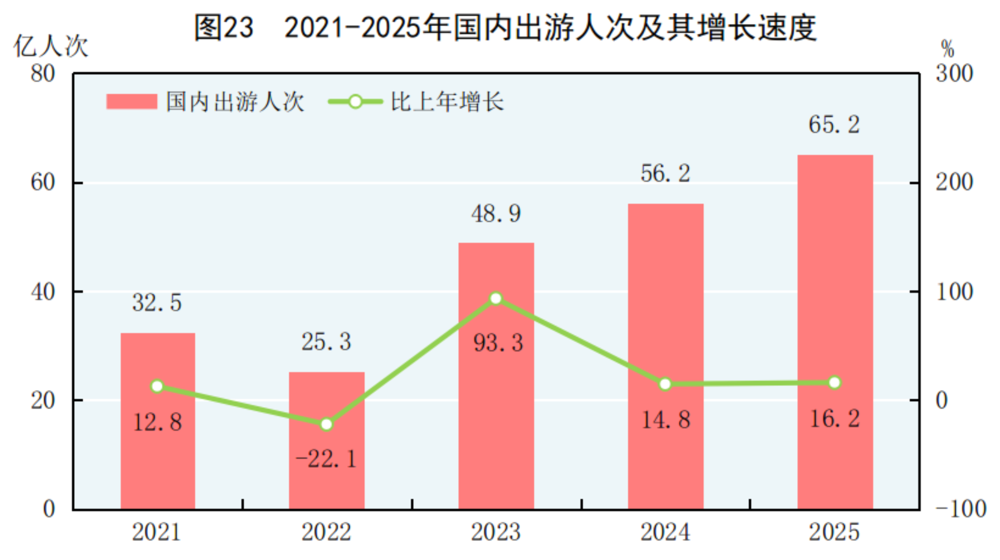

年末全国共有医疗卫生机构110.7万个，其中医院3.8万个，在医院中有公立医院1.2万个，民营医院2.6万个；基层医疗卫生机构105.5万个，其中乡镇卫生院3.3万个，社区卫生服务中心（站）3.8万个，门诊部（所）42.4万个，村卫生室56.0万个；专业公共卫生机构9231个（不含卫生监督所、中心），其中疾病预防控制中心3478个。卫生技术人员1340万人，其中执业医师和执业助理医师529万人，注册护士603万人。医疗卫生机构床位1009万张，其中医院799万张，乡镇卫生院144万张。全年总诊疗人次[81]105.8亿人次，出院人次[82]3.0亿人次。

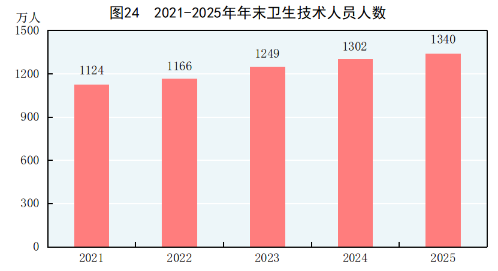

年末全国共有体育场地[83]500.4万个，体育场地面积[84]43.7亿平方米，人均体育场地面积3.1平方米。全年我国运动员在31个项目中获得146个世界冠军，共创17项世界纪录。在哈尔滨第9届亚洲冬季运动会上，我国运动员共获得32枚金牌、27枚银牌、26枚铜牌，共计85枚奖牌，位列金牌榜和奖牌榜首位，创造亚洲冬季运动会历史参赛最好成绩。我国残疾人运动员在23项国际赛事中获得179个世界冠军。

## 十二、资源、环境和应急管理

全年全国国有建设用地供应总量[85]47.1万公顷，比上年下降22.2%。其中，工矿仓储用地13.8万公顷，下降10.8%；房地产用地[86]6.2万公顷，下降14.4%；基础设施用地27.2万公顷，下降28.4%。

全年完成造林面积356万公顷，其中人工造林面积83万公顷，占全部造林面积的23.2%。种草改良面积[87]493万公顷。截至年末，共有国家公园5个。

初步核算，全年能源消费总量61.7亿吨标准煤，比上年增长3.5%。煤炭消费量增长0.1%，原油消费量增长3.6%，天然气消费量增长2.0%，电力消费量增长5.0%。煤炭消费量占能源消费总量比重为51.4%，比上年下降1.8个百分点；天然气、水电、核电、风电、太阳能发电等清洁能源消费量占能源消费总量比重为30.4%，上升1.8个百分点。重点耗能工业企业单位电石综合能耗下降0.7%，单位合成氨综合能耗下降2.3%，吨钢综合能耗上升1.9%，单位电解铝综合能耗下降0.9%，每千瓦时火力发电标准煤耗与上年持平。初步测算，扣除原料用能和非化石能源消费量后，全国万元国内生产总值能耗[88]比上年下降5.1%。全国碳排放权交易市场碳排放配额[89]成交量2.35亿吨，成交额146.3亿元。

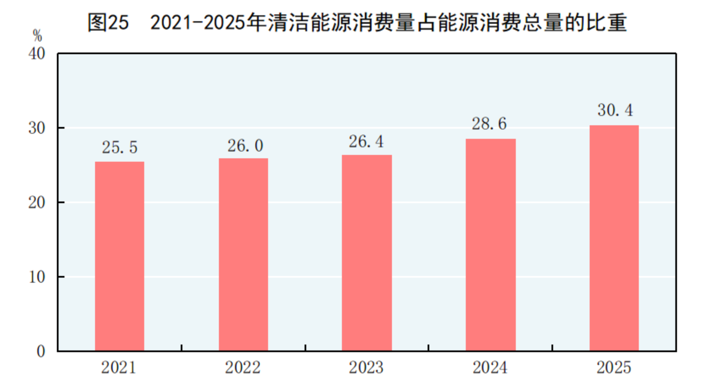

全年近岸海域海水水质[90]达到国家一、二类海水水质标准的面积占84.9%，三类海水占4.6%，四类、劣四类海水占10.5%。

在监测的339个地级及以上城市中，细颗粒物（PM2.5）年平均浓度28.0微克/立方米，比上年下降4.4%。

在开展城市区域声环境昼间监测的332个城市中，全年声环境质量好的城市占9.3%，较好的占65.1%，一般的占25.0%，较差的占0.6%，无差的城市。

全年平均气温为10.9℃，与上年持平。共有10个台风登陆。

全年农作物受灾面积607万公顷，其中绝收69万公顷。因洪涝和地质灾害造成直接经济损失1666亿元，因干旱灾害造成直接经济损失86亿元，因低温冷冻和雪灾造成直接经济损失9亿元，因海洋灾害造成直接经济损失89亿元。共发生5.0级以上地震11次，各级地震共造成直接经济损失97亿元。共发生森林火灾225起，受害森林面积约0.5万公顷。

全年各类生产安全事故共死亡18261人，比上年下降7.0%。工矿商贸企业就业人员十万人生产安全事故死亡人数1.040人，比上年下降4.5%；煤矿百万吨死亡人数0.045人，下降23.7%。道路交通事故万车死亡人数1.25人，下降4.6%。

## 注释

[1]本公报中数据均为初步统计数。各项统计数据均未包括香港特别行政区、澳门特别行政区和台湾省。部分数据因四舍五入的原因，存在总计与分项合计不等的情况。

[2]国内生产总值、三次产业及相关行业增加值、地区生产总值、人均国内生产总值和国民总收入绝对数按现价计算，增长速度按不变价格计算。

[3]国民总收入，原称国民生产总值，是指一个国家或地区所有常住单位在一定时期内所获得的初次分配收入总额，等于国内生产总值加上来自国外的初次分配收入净额。

[4]全员劳动生产率为国内生产总值（按2020年价格计算）与全部就业人员的比率。

[5]全国人口是指我国大陆31个省、自治区、直辖市和现役军人的人口，不包括居住在31个省、自治区、直辖市的港澳台居民和外籍人员。

[6]2025年末，0-14岁（含不满15周岁）人口为21276万人，15-59岁（含不满60周岁）人口为86875万人。

[7]城镇新增就业人数是指报告期内城镇累计新就业人员数与自然减员人数之差。

[8]年度农民工数量包括年内在本乡镇以外从业6个月及以上的外出农民工和在本乡镇内从事非农产业6个月及以上的本地农民工。

[9]农产品生产者价格是指农产品生产者第一手出售其产品时实际获得的单位产品价格。

[10]居住类价格包括租赁房房租、住房保养维修及管理、水电燃料、自有住房服务价格。

[11]由于统计调查制度规定的调查范围变动、统计执法、剔除重复数据等因素，2025年规模以上工业相关指标增速及变化按可比口径计算。

[12]装备制造业包括金属制品业，通用设备制造业，专用设备制造业，汽车制造业，铁路、船舶、航空航天和其他运输设备制造业，电气机械和器材制造业，计算机、通信和其他电子设备制造业，仪器仪表制造业。

[13]高技术制造业包括医药制造业，航空、航天器及设备制造业，电子及通信设备制造业，计算机及办公设备制造业，医疗仪器设备及仪器仪表制造业，信息化学品制造业。

[14]数字产品制造业包括计算机制造，通讯及雷达设备制造，数字媒体设备制造，智能设备制造，电子元器件及设备制造，其他数字产品制造业。

[15]部分服务行业规模以上企业统计范围包括：年营业收入2000万元及以上的交通运输、仓储和邮政业，信息传输、软件和信息技术服务业，水利、环境和公共设施管理业，卫生行业法人单位；年营业收入1000万元及以上的房地产业（不含房地产开发经营），租赁和商务服务业，科学研究和技术服务业，教育行业法人单位；以及年营业收入500万元及以上的居民服务、修理和其他服务业，文化、体育和娱乐业，社会工作行业法人单位。未包括金融业、批发和零售业、住宿和餐饮业、房地产开发经营行业法人单位。2025年部分服务行业规模以上企业财务指标增速按可比口径计算。

[16]战略性新兴服务业包括新一代信息技术产业、高端装备制造产业、新材料产业、生物产业、新能源汽车产业、新能源产业、节能环保产业和数字创意产业等八大产业中的服务业相关行业，以及新技术与创新创业等相关服务业。

[17]高技术服务业包括信息服务、电子商务服务、检验检测服务、专业技术服务业的高技术服务、研发与设计服务、科技成果转化服务、知识产权及相关法律服务、环境监测及治理服务。

[18]电子商务交易额是指通过电子商务交易平台（包括企业自建平台和第三方平台）实现的商品和服务交易额，包括对单位和对个人交易额，2025年增速按可比口径计算。

[19]网上零售额是指通过公共网络交易平台（主要从事实物商品交易的网上平台，包括自建网站和第三方平台）实现的商品和服务零售额，2025年增速按可比口径计算。

[20]由于投资统计制度方法改革、统计执法检查等因素，2025年固定资产投资相关指标增速按可比口径计算。

[21]东部地区是指北京、天津、河北、上海、江苏、浙江、福建、山东、广东和海南10省（市）；中部地区是指山西、安徽、江西、河南、湖北和湖南6省；西部地区是指内蒙古、广西、重庆、四川、贵州、云南、西藏、陕西、甘肃、青海、宁夏和新疆12省（区、市）；东北地区是指辽宁、吉林和黑龙江3省。

[22]万元国内生产总值二氧化碳排放核算口径包含能源活动、工业生产过程产生的二氧化碳排放，按2020年价格计算。

[23]见注释[11]。

[24]钢材产量数据中含企业之间重复加工钢材。

[25]见注释[11]。

[26]产能利用率是指实际产出与生产能力（均以价值量计量）的比率。企业的实际产出是指企业报告期内的工业总产值；企业的生产能力是指报告期内，在劳动力、原材料、燃料、运输等保证供给的情况下，生产设备（机械）保持正常运行，企业可实现并能长期维持的产品产出。

[27]火电包括燃煤发电量，燃油发电量，燃气发电量，余热、余压、余气发电量，生物质发电量。

[28]少量发电装机容量（如地热等）公报中未列出。

[29]由于统计执法检查、剔除重复数据等因素，2025年建筑业企业利润增速按可比口径计算。

[30]见注释[15]。

[31]货物运输总量及周转量包括铁路、公路、水路、民航和管道五种运输方式完成量，2025年增速按可比口径计算。

[32]2025年调整网约车载客系数，相应对出租汽车城市客运量等指标本年度及上年同期数据进行调整。2025年旅客运输总量、旅客运输周转量、公路旅客运输量、公路旅客运输周转量增速按可比口径计算。

[33]邮政行业寄递业务总量是指企业从事各类邮政普遍服务业务、快递业务的总数量。

[34]电信业务总量按上年价格计算。

[35]移动电话基站数是指报告期末为小区服务的无线收发信设备，处理基站与移动台之间的无线通信，在移动交换机与移动台之间起中继作用，监视无线传输质量的全套设备数。

[36]固定互联网宽带接入用户是指报告期末在电信企业登记注册，通过xDSL、FTTx+LAN、FTTH/O以及其他宽带接入方式和普通专线接入公众互联网的用户。

[37]1000M速率及以上的宽带接入用户是指报告期末下行速率大于或等于1000Mbit/s的宽带接入用户。

[38]移动物联网终端用户是指报告期末接入移动通信网络并开通物联网业务的用户。物联网终端即连接传感网络层和传输网络层，实现远程采集数据及向网络层发送数据的物联网设备。

[39]软件和信息技术服务业包括软件开发、集成电路设计、信息系统集成和物联网技术服务、运行维护服务、信息处理和存储支持服务、信息技术咨询服务、数字内容服务和其他信息技术服务等行业。2025年软件和信息技术服务业完成软件业务收入增速按可比口径计算。

[40]2024年快递业务量统计口径调整，当年增速按可比口径计算。

[41]服务零售额是指企业（产业活动单位、个体户）以交易形式直接提供给个人和其他单位非生产、非经营用的服务价值总和，旨在反映服务提供方以货币形式销售的属于消费的服务价值，包括交通、住宿、餐饮、教育、卫生、体育、娱乐等领域服务活动的零售额。

[42]见注释[19]。

[43]见注释[20]。

[44]见注释[21]。

[45]基础设施投资包括铁路运输业、道路运输业、水上运输业、航空运输业、管道运输业、多式联运和运输代理业、装卸搬运业、邮政业、电信广播电视和卫星传输服务业、互联网和相关服务业、水利管理业、生态保护和环境治理业、公共设施管理业投资。

[46]社会领域投资包括教育，卫生和社会工作，文化、体育和娱乐业投资。

[47]民间投资是指具有集体、私营、个人性质的内资调查单位以及由其控股（包括绝对控股和相对控股）的调查单位在国内建造或购置固定资产的投资。

[48]房地产业投资除房地产开发投资外，还包括建设单位自建房屋以及物业管理、中介服务和其他房地产投资。

[49]根据房地产开发统计制度、统计执法检查等规定，对上年同期房地产开发投资、新建商品房销售面积等数据进行修订，2025年增速按可比口径计算。

[50]新建商品房销售面积是指报告期内房地产开发企业出售的新建商品房屋的合同总面积。

[51]二手房交易网签面积是指报告期内城镇二手房网签交易合同总面积。

[52]《区域全面经济伙伴关系协定》（RCEP）其他成员国包括文莱、缅甸、柬埔寨、印度尼西亚、老挝、马来西亚、菲律宾、新加坡、泰国、越南、日本、韩国、澳大利亚、新西兰。

[53]自2025年1月起，中国人民银行启用新修订的狭义货币（M1）统计口径。修订后的M1包括流通中货币（M0）、单位活期存款、个人活期存款、非银行支付机构客户备付金，2025年增速按可比口径计算。

[54]社会融资规模增量是指一定时期内实体经济从金融体系获得的资金总额。

[55]社会融资规模存量是指一定时期末（月末、季末或年末）实体经济从金融体系获得的资金余额。

[56]普惠小微贷款包括单户授信小于1000万元的小微企业贷款、个体工商户经营性贷款、小微企业主经营性贷款。

[57]新发放企业贷款加权平均利率是指以全年新发放企业贷款金额（本外币）为权重计算的加权平均利率。

[58]沪深交易所股票筹资额按上市日统计，筹资额包括了可转债实际转股金额，2024年、2025年可转债实际转股金额分别为1694亿元、2267亿元。

[59]北京证券交易所股票筹资额按上市日统计。

[60]全国中小企业股份转让系统挂牌公司累计筹资不含优先股，股票筹资按新增股份挂牌日统计。

[61]公司信用类债券包括非金融企业债务融资工具、企业债券以及公司债、可转债等。

[62]原保险保费收入是指保险企业确认的原保险合同保费收入。

[63]人均可支配收入中位数是指将所有调查户按人均收入水平从低到高顺序排列，处于最中间位置调查户的人均可支配收入。

[64]全国居民五等份收入分组是指将所有调查户按人均收入水平从低到高顺序排列，平均分为五个等份，处于最低20%的收入家庭为低收入组，依此类推依次为中间偏下收入组、中间收入组、中间偏上收入组、高收入组。

[65]脱贫县包括原832个国家扶贫开发工作重点县和集中连片特困地区县，以及新疆阿克苏地区7个市县。

[66]服务性消费支出是指住户用于各种生活服务的消费支出，包括餐饮服务、衣着鞋类加工服务、居住服务、家庭服务、交通通信服务、教育文化娱乐服务、医疗服务和其他服务。

[67]农村特困人员是指无劳动能力，无生活来源，无法定赡养、抚养、扶养义务人或者其法定义务人无履行义务能力的农村老年人、残疾人以及未满16周岁的未成年人。

[68]临时救助包括国家对遭遇突发事件、意外伤害、重大疾病或其他特殊原因导致基本生活陷入困境，其他社会救助制度暂时无法覆盖或救助之后基本生活暂时仍有严重困难的家庭或个人给予的应急性、过渡性的救助，以及冬季取暖救助、价格临时补贴、年节走访慰问等其他临时救助。

[69]民政服务床位除收养性机构外，还包括救助类机构、社区类机构的床位。

[70]PCT（Patent Cooperation Treaty）即专利合作条约，是专利领域的一项国际合作条约。PCT专利申请受理量是指国家知识产权局作为PCT专利申请受理局受理的PCT专利申请数量。

[71]每万人口高价值发明专利拥有量是指每万人口本国居民拥有的经国家知识产权局授权的符合下列任一条件的有效发明专利数量：战略性新兴产业的发明专利；在海外有同族专利权的发明专利；维持年限超过10年的发明专利；实现较高质押融资金额的发明专利；获得国家科学技术奖、中国专利奖的发明专利。

[72]公民具备科学素质是指崇尚科学精神，树立科学思想，掌握基本科学方法，了解必要科技知识，并具有应用其分析判断事物和解决实际问题的能力。

[73]制造业产品质量合格率是指按照规定的方法、程序和标准实施质量抽样检测，判定为质量合格的样品数占全部抽样样品数的百分比。

[74]普通、职业本专科包括普通本科、职业本科、高职（专科）。

[75]中等职业教育包括普通中专、成人中专、职业高中和技工学校。

[76]总流通人次是指本年度内到图书馆场馆接受图书馆服务的总人次，包括借阅书刊、咨询问题以及参加各类读者活动等。

[77]虚拟现实影片是指运用虚拟现实（含增强现实、混合现实）有关技术制作、采用头戴式显示设备等虚拟现实终端观赏、用于电影院等固定放映场所公开放映的新形态电影。

[78]特种影片是指与常规影院放映影片相比，在技术、设备、节目方面采用不同电影展示方式的影片，如巨幕电影、立体特效（4D）电影、动感电影、球幕电影等。

[79]人均图书拥有量是指在一年内全国平均每人能拥有的当年出版图书册数。

[80]文化新业态特征明显的16个行业小类是：广播电视集成播控，互联网搜索服务，互联网其他信息服务，数字出版，其他文化艺术业，动漫、游戏数字内容服务，互联网游戏服务，多媒体、游戏动漫和数字出版软件开发，增值电信文化服务，其他文化数字内容服务，互联网广告服务，互联网文化娱乐平台，版权和文化软件服务，娱乐用智能无人飞行器制造，可穿戴智能文化设备制造，其他智能文化消费设备制造。

[81]总诊疗人次是指所有接受诊疗服务的总人次数，包括门诊、急诊、出诊、预约诊疗、单项健康检查、健康咨询指导（不含健康讲座、核酸检测）人次数。

[82]出院人次是指报告期内所有住院后出院的人次数，包括医嘱离院、医嘱转其他医疗机构、非医嘱离院、死亡及其他人次数，不含家庭病床撤床人次数。

[83]体育场地调查对象不包括军队、铁路系统所属体育场地。

[84]体育场地面积是指体育训练、比赛、健身场地的有效面积。

[85]国有建设用地供应总量是指报告期内市、县人民政府根据年度土地供应计划依法以出让、划拨、租赁等方式与用地单位或个人签订出让合同或签发划拨决定书、完成交易的国有建设用地总量。

[86]房地产用地是指商服用地和住宅用地的总和。

[87]种草改良面积是指通过人工种草、飞播种草、草原改良、围栏封育等措施进行草原生态修复的面积之和。

[88]万元国内生产总值能耗按2020年价格计算。

[89]全国碳排放权交易市场碳排放配额是指在全国碳排放权交易市场分配给重点排放单位规定时期内的二氧化碳等温室气体的排放额度。1个单位碳排放配额相当于向大气排放1吨的二氧化碳当量。

[90]近岸海域海水水质采用面积法进行评价。

## 资料来源

本公报中城镇新增就业、养老保险、失业保险、工伤保险、中等职业教育中的技工学校数据来自人力资源和社会保障部；外汇储备、汇率数据来自国家外汇管理局；经营主体、质量检验、国家标准制定修订、制造业产品质量合格率数据来自国家市场监督管理总局；民用汽车保有量、道路交通事故数据来自公安部；环境质量、碳排放权交易数据来自生态环境部；水产品产量数据来自农业农村部；木材产量、造林面积、种草改良面积、国家公园数据来自国家林业和草原局；发电装机容量、新增220千伏及以上交流变电设备容量、电力消费量数据来自中国电力企业联合会；港口货物吞吐量、港口集装箱吞吐量、公
